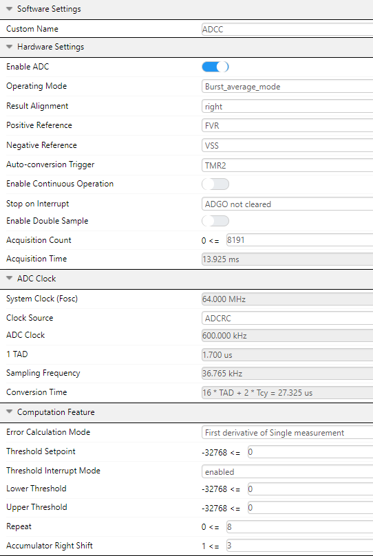

[](https://www.microchip.com)

# Using the Temperature Indicator on PIC18F16Q41
In this example, the ADCC will be configured to sample the Temperature Indicator Module to measure the PIC18F16Q41 device temperature periodically.
## Related Documentation

* [PIC18F16Q41 Datasheet](https://ww1.microchip.com/downloads/en/DeviceDoc/PIC18F06-16Q41-DataSheet-40002214C.pdf)

* [PIC18F16Q41 Device Page](https://www.microchip.com/wwwproducts/en/PIC18F16Q41)

* [PIC18F16Q41 Curiosity Nano Users Guide](https://ww1.microchip.com/downloads/en/DeviceDoc/PIC18F16Q41-Curiosity-Nano-Hardware-User-Guide-DS50003048A.pdf)

## Software Used

- MPLAB® X IDE 5.45.0 or newer [(MPLAB® X IDE 5.45)](https://www.microchip.com/en-us/development-tools-tools-and-software/mplab-x-ide?utm_source=GitHub&utm_medium=TextLink&utm_campaign=MCU8_MMTCha_MPAE_Examples&utm_content=pic18f16q41-adcc-temp-sensor-mplab-mcc-github)
- MPLAB® XC8 2.31.0 or newer compiler [(MPLAB® XC8 2.31)](https://www.microchip.com/en-us/development-tools-tools-and-software/mplab-xc-compilers?utm_source=GitHub&utm_medium=TextLink&utm_campaign=MCU8_MMTCha_MPAE_Examples&utm_content=pic18f16q41-adcc-temp-sensor-mplab-mcc-github)
* [MPLAB Code Configurator (MCC)](https://www.microchip.com/mplab/mplab-code-configurator)
  * Melody Library v1.37.22
* [MPLAB Data Visualizer Plugin](https://www.microchip.com/en-us/development-tools-tools-and-software/embedded-software-center/mplab-data-visualizer) or other serial terminal


## Hardware Used

* [PIC18F16Q41 Product Information](https://www.microchip.com/wwwproducts/en/PIC18F16Q41)

## Setup

**Step #1: Creating the Project**

+ On the tool bar, click on New Project
+ Microchip Embedded; Standalone Project
+ Enter the Device
  + For this Project: PIC18F16Q41
+ Enter a name for this project, such as *adcc-temp-sensor*
  + Name: “adcc-temp-sensor”
  + **Note: The project name cannot have any empty spaces**

  **Step #2: MPLAB Code Configurator (MCC)**

  +	Modify the Clock Control
    +	Set “Clock Source” to High Frequency Internal Oscillator (HFINTOSC)
    + Set “HF Internal Clock” to 64_MHz
    + Set “Clock Divider” to 1


+ Set Configuration Bits
  + Disable "External Oscillator Mode Selection"
  + Set "Power-up Default Value for COSC" to "HFINTOSC with HFFRQ = 64MHz and CDIV = 1:1"
  + Ensure that "WDT Operating Mode" is set to "WDT Disabled; SWDTEN is ignored"


**Step #3: Adding ADCC, FVR, Memory, Timer, and UART peripherals**

For this project to run properly, the application will go through a series of steps in order to read back an accurate/precise device temperature.
  - These steps are: ADCC is set up to run periodically &rarr; Device is put to sleep &rarr; temp sensor is measured &rarr; Wake-Up device on interrupt &rarr; Convert result to Temperature &rarr; Print result using UART.

  + In Device Resources:
      + Drivers &rarr; ADCC &rarr; ADCC
      + Drivers &rarr; FVR &rarr; FVR
      + Drivers &rarr; Memory &rarr; MEMORY
      + Drivers &rarr; Timer &rarr; TMR2
      + Drivers &rarr; UART &rarr; UART1

  


  **Once the peripherals are added, modify the peripherals:**

  Please refer to the Temperature Indicator Module on the [PIC18F16Q41 Datasheet](https://ww1.microchip.com/downloads/en/DeviceDoc/PIC18F06-16Q41-DataSheet-40002214C.pdf) when configuring these peripherals


  + TMR2
    + Hardware Settings
      + ***Control Mode:*** Roll over pulse
      + ***Start/Reset Option:*** Software control
    + Timer Clock
      + ***Clock Source:*** LFINTOSC
      + ***Prescaler:*** 1:8
      + ***Postscaler:*** 1:12
    + Timer Period(s)
      + ***Time Period (s):*** 0.6


  + FVR
    + ***Custom Name:*** FVR
    + ***Enable FVR:*** Enabled
    + ***FVR_buffer 1 Gain (to ADC):*** 2x
    + ***Enable Temperature Sensor:*** Enabled
    + ***Voltage Range Selection***: Hi_Range


  


  + ADCC
    + Hardware Settings
      + ***Operating Mode:*** Burst Average
      + ***Result Alignment:*** right
      + ***Positive Reference:*** FVR
      + ***Auto-conversion Trigger***: TMR2
      + ***Acquisition Count***: 8191
    + ADC Clock
      + ***Clock Source:*** ADCRC
    + Computation Feature
      + ***Error Calculation Mode:*** First derivative of Single measurement
      + ***Threshold Interrupt Mode:*** enabled
      + ***Repeat:*** 8
      + ***Accumulator Right Shift:*** 3
    + Interrupt settings
      + ***ADC Threshold is enabled***

  
  

  + UART1
    + Software Settings:
      +	Enable "Redirect STDIO to UART" in order to use the function (printf) for sending messages.
    + Hardware Settings:
      +	Enable UART box should be checked
      + Enable transmit and Receive should be checked
      + Set the Baud Rate to 19200
      + Everything else can be left as default settings


  + ***In order for the Temperature calculation to be made, gain and offset need to be read from the Device Information Area (DIA). By configuring the memory peripheral this allows access to read those values.***
  + Memory
      + ***Custom Name:*** FLASH
      + ***Add Data EE Routines:*** Enabled

  


  **Step #4: Configure the Pins**
  + **TX1** is connected to pin RB7
  + **RX1** is connected to pin RB5


**Step #5: Generate the project**
+ Click the generate button in MCC to create the appropriate header and source files for this configuration


**Step #6: Modifying main.c**
+ Upon the generation being completed, the new MCC generated header and source files will be in the project window. Select the main.c file and you will see an empty while(1) loop where you can add your application code.
+ Refer to section 39.2 on the  [PIC18F16Q41 Datasheet](https://ww1.microchip.com/downloads/en/DeviceDoc/PIC18F06-16Q41-DataSheet-40002214C.pdf) to fully understand the Temperature Calculation

```
#include "mcc_generated_files/system/system.h"

#define SetAcquisitionChannel(X) do { ADPCH = X; } while (0)
//Sets sampling channel of ADCC without starting conversion
    int16_t gain;
    int16_t offset;

int main(void)
{
    SYSTEM_Initialize();

    gain = FLASH_ReadWord(DIA_TSHR1);  
    offset = FLASH_ReadWord(DIA_TSHR3);

    INTERRUPT_GlobalInterruptEnable();
    uint16_t ADC_MEAS = 0;
    int24_t temp_c = 0;
    SetAcquisitionChannel(channel_Temp);


   while(1)
    {    
        asm ("SLEEP");
        asm ("NOP");
        ADC_MEAS = ADCC_GetConversionResult();
        temp_c = (int24_t) (ADC_MEAS) * gain;
        temp_c = temp_c / 256;
        temp_c = temp_c + offset;
        temp_c = temp_c / 10;
        printf("Temp Sensor Result %d \r\n", temp_c);
   }
}

```


+ Make and Program the Device


**Step #7: MPLAB Data Visualizer**
  + Open up the Data Visualizer on the host computer and select the COM port associated with the Curiosity Nano.

    

  + Ensure that the Terminal tab is selected

  

  + Once selected, configure the data visualizer to communicate at 19200 baud, no parity, and 1 stop bit.  

  

  + If everything is setup correctly, then the Data Visualizer should start displaying the device temperature periodically.

  


  ## Summary

  This application demonstrates how to set up an ADCC and utilize the Temperature Indicator Module to measure the device temperature
